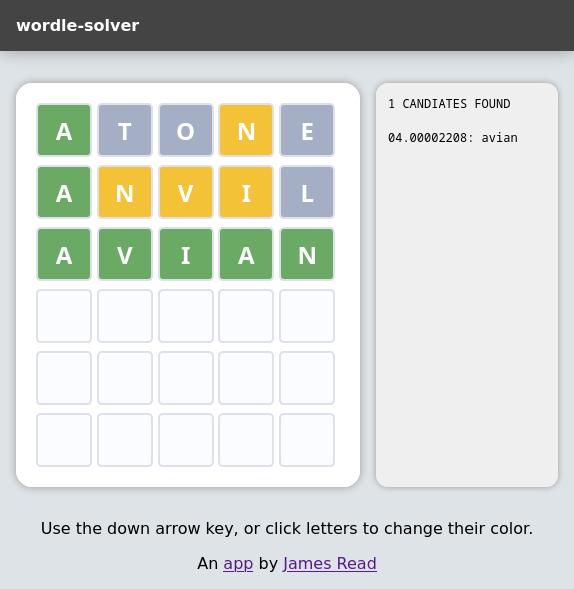

	<h1>wordle-solver</h1>
	
Crush wordle with just filtering logic.

A very simple web app to solve wordle - it suggests a ranking of the best possible next guesses that statistically is most likely to win the game in as few moves as possible.

The ranking of words is determined by an algorithm that is mostly just using constraint-based filtering of the English dictionary, based on the results of guesses, coupled with the frequency statistics of probable words.

This app has a solve rate within the very high 90% - probably 98%, and most of the time loss is simply down to human input error or occasionally words not existing in the dictionary, otherwise, it generally destroys, I mean, solves, wordle, very nicely :)

* [Wordle - Original game](https://www.nytimes.com/games/wordle/index.html) 
* [Wordly - allows infinate plays](https://wordly.org/)

## Interesting game variations 

* [Octordle - Paralell 8 way](https://www.britannica.com/games/octordle/)
* [Victordle - Multipler supposedly, but feels like bots](https://www.britannica.com/games/victordle/), this app scores on average 81% win over 50 games (the 20% "loss" is that sometimes the opponent guesses correctly first!)

## Installation (docker container)

This is by far the easiest way to run the app, simply run the container like this;

	docker run --name wordle-solver -p 8080:8080 ghcr.io/jamesread/wordle-solver

## Installation (local)

Pip install the dependencies;

    pip install enwords
    pip install wordfreq

### Run

    ./wordle-solver.py
